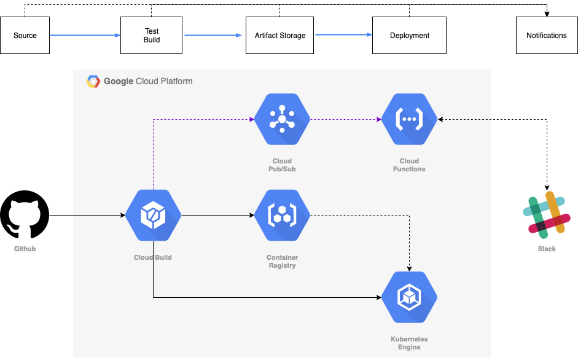

# Cloud Native CI/CD on GCP

## Overview

This repository contains code for the sample application and the cloud functions used during the demo of the Cloud Native CI/CD talk given by Vishal Parpia at the Google Cloud Summit Singapore ‘19.

The /app folder contains the sample NodeJs application along with the CloudBuild yaml, Docker files and Kubernetes yaml. The application has some unit tests and integration tests defined which are checked during the build process.

The /functions folder contains the code for the Cloud Functions to listen to Cloudbuild updates and Slack approval events.


## Prcess Flow

The source for the application to be deployed is this GitHub repository. When a pull request is raised to the master branch it triggers CloudBuild to build and test code based on the PR. If it is successful then the user can merge the PR into the master branch. 

Merging the PR triggers another CloudBuild to perform unit tests, build the Docker image, push the image to Google Container Repository, deploy it to Kubernetes pods for the staging environment and then perform integration tests.

Notifications at each stage are sent to a Slack channel. 

The user can now decide if he wants to roll out the build to production, this can be done by clicking on YES or NO action buttons which will be showing in the Slack channel to approve the rollout. If the rollout is approved then another CloudBuild trigger is executed which deploys it to Kubernetes pods for the production environment.

## Architecture



## Setup Instructions

### Setting up GitHub Repository

* Generate an SSH key using `ssh-keygen -t rsa -b 4096 -C “a@b.com”`
* Add the public part of key generated above in Repository’s Deploy Keys (Settings -> Deploy Keys -> Add Key)
* Encrypt the private part of key using Google KMS
  * Create a keyring
    
    ```gcloud kms keyrings create {keyring_name} --location=global```
    
  * Create key
    
    ```gcloud kms keys create {key_name} --location=global --keyring={keyring_name} --purpose=encryption```

  * Whitelist cloudbuild service account to decrypt the above key. This can be done as:
    
    In GCP Console: IAM -> Cryptographic keys -> {keyring_name} -> {key_name} -> Show Info Panel -> Add Member -> Give Decrypter permission to cloudbuild service account
    
  * Encrypt your private key
    
    ```gcloud kms encrypt --plaintext-file={private_key_path} --ciphertext-file={enc_key_path} --location=global --keyring={keyring_name} --key={key_name}```

  * Replace the encrypted key at path `app/repo-key-encrypted` with your key

  * Create `production-candidate` branch. Replace the encrypted key generated and production kubernetes.yaml file and push it to repo.
  * Create `production` branch and push it (can be empty). Production configs are stored here
    
    ```Note: production-candidate and production branches should ideally be in different repository as it holds production configuration. The key added to production-candidate branch is for the repo holding production config.```

### Create GKE Clusters

Create two clusters, one for staging environment and other for production. Not down cluster names and deployment zones

### Connecting Repository to CloudBuild

* Cloudbuild -> Triggers -> Connect Repository -> check GitHub App by Google -> Authenticate -> Select your repository -> Skip creating triggers for now
Create Triggers
* Create Trigger for Push on master branch. With following details
  
  ```
  Type: Branch
  Regex: master
  
  Cloudbuild config path: app/cloudbuild-master.yml
  Substitution Vars:
    _APP_DIR: app
    _GITHUB_REPO_ENC_KEY_PATH: app/repo-key-encrypted/id_rsa_repo_key.enc
    _GITHUB_REPO_KEY: {key_name}
    _GITHUB_REPO_KMS_KEYRING: {keyring_name}
    _GITHUB_REPO_USERNAME: cldcvr
    _IMAGE_ID: gcp-cnci-example-app
    _PRODUCTION_CANDIDATE_BRANCH: production-candidate
    _PRODUCTION_KUBERENETES_TEMPLATE_FILE_NAME: kubernetes.yaml.tpl
    _PRODUCTION_KUBERNETES_CONFIG_FILE_NAME: kubernetes.yaml
    _STAGING_DEPLOY_CLUSTER: {STAGING_GKE_CLUSTER_NAME}
    _STAGING_DEPLOY_ZONE: {STAGING_GKE_CLUSTER_ZONE}
    _STAGING_KUBERENETES_TEMPLATE_FILE_NAME: staging-kubernetes.yaml.tpl
    _STAGING_KUBERNETES_CONFIG_FILE_NAME: staging-kubernetes.yaml
  ```
* Create Trigger for PR on master with details:

  ```
  Type: Pull Request
  Regex: master
  
  Cloudbuild config: app/cloudbuild-master-pr.yml
  Substitution Vars:
    _APP_DIR: app
  ```
* Create Trigger for push on production-candidate with details

  ```
  Type: Branch
  Regex: random_string. Note: Put random non existent branch. We will be firing this trigger manually. Note down the trigger name.
  
  Cloudbuild config: cloudbuild-delivery.yml
  Substitution vars:
    _GITHUB_REPO_ENC_KEY_PATH: repo-key-encrypted/id_rsa_repo_key.enc
    _GITHUB_REPO_KEY: {prod_config_repo_key_name}
    _GITHUB_REPO_KMS_KEYRING: {prod_config_repo_keyring_name}
    _GITHUB_REPO_USERNAME: cldcvr
    _PRODUCTION_BRANCH: production
    _PRODUCTION_DEPLOY_CLUSTER: {PRODUCTION_GKE_CLUSTER_NAME}
    _PRODUCTION_DEPLOY_ZONE: {PRODUCTION_GKE_CLUSTER_ZONE}
    _PRODUCTION_KUBERNETES_CONFIG_FILE_NAME: kubernetes.yaml
  ```

### Generate Slack Bot User Token

You can get the bot user token using OAuth2 or from your slack app dashboard (if you are using bot for your own workspace). For more information see: https://api.slack.com/docs/oauth#bots

### Deploy Cloudfunctions

* Replace trigger name in `functions/repos.js` with your production trigger name.
* Deploy Functions
   * Slack Approval Events Listener
   
    ```
    cd functions
    gcloud functions deploy gcpCiCdApprovalAction --runtime nodejs10 --trigger-http --set-env-vars SLACK_BOT_TOKEN='{BOT_TOKEN}' --set-env-vars GCLOUD_PROJECT='{PROJECT_ID}'  --service-account={CLOUDFUNCTION_SERVICE_ACCOUNT}
    ```
   * CloudBuild Event Listener
   
   ```
    cd functions
    gcloud functions deploy gcpCiCdSlackEvents --runtime nodejs10 --trigger-topic cloud-builds --set-env-vars SLACK_BOT_TOKEN='{BOT_TOKEN}' --set-env-vars GCLOUD_PROJECT='cloudcover-sandbox' --service-account={CLOUDFUNCTION_SERVICE_ACCOUNT}
   ```
   
